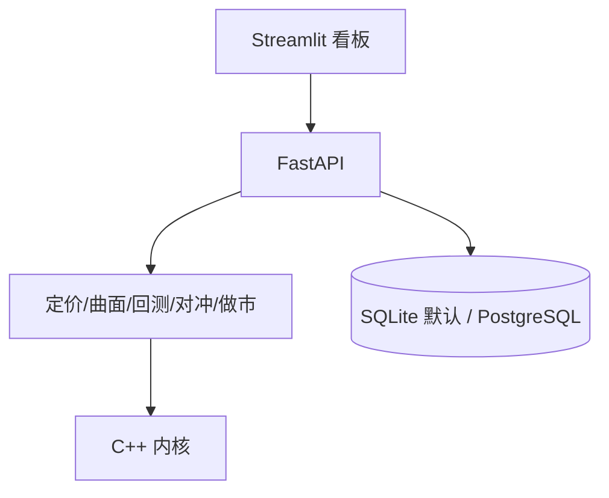

# 期权定价、波动率曲面与风险验证平台


一个端到端的**期权定价、波动率建模、回测、动态对冲与做市仿真研究平台**，
强调数值正确性、可复现性与工程质量：六种定价模型全部通过收敛/退化验证，
回测的 PnL 逐笔对账精度达 3.5e-11，事件驱动做市仿真与论文
*Continuous-time RL for market making* 直接对应。

> 定位：研究型仿真平台，不是生产交易系统；历史策略回测使用真实 SPY
> 标的价格与透明的合成期权报价，真实期权链仅用于快照分析。

## 核心特性

- 📊 **六种定价模型**（BSM / CRR / 有限差分 / 蒙特卡洛 / Heston / Merton，
  另有局部波动率），全部通过收敛与退化验证；
- 📈 **真实 SPY 期权快照**：报价清洗 → 无套利检查 → IV 反解 → SVI 曲面
  校准（734/872 活跃报价反解成功，分到期 RMSE 3.9e-5~1.7e-4）；
- 🔄 **严格时间线回测**：信号滞后一日、训练/验证/测试隔离、测试集锁定、
  PnL 桥逐笔对账（17 笔最大差异 3.456e-11）；
- ⚡ **C++ 加速核心**（批量 BS/IV/MC/情景重估/组合 VaR，ctypes 绑定，
  一致性验证 1e-9 量级）；
- 🎯 **多合约 Greeks 感知做市**：库存偏斜 / Greeks 偏斜 / DP / 事件驱动
  Actor–Critic，同订单流、多种子公平对照；
- ✅ **分层测试 + 模型验证 + CI**：300+ 测试、覆盖率门槛 80%（实测 ~86%）、
  ruff/mypy、C++ 编译测试、PostgreSQL 服务容器。

## 架构



完整分层、数据流与做市事件流见 [docs/architecture.md](docs/architecture.md)。

## 快速开始

环境：Python 3.12（依赖锁定版本要求 ≥3.12）。

```bash
git clone https://github.com/burger56487/options-volatility-backtester.git
cd options-volatility-backtester
python -m pip install --upgrade pip
pip install -r requirements.txt
pip install -r requirements-dev.txt        # 测试/API/Postgres 依赖
```

跑完整测试与覆盖率门槛：

```bash
PYTHONPATH=. python -m pytest -q -m "not perf"
```

生成模型验证报告（`outputs/testing/validation_report.*`）：

```bash
PYTHONPATH=. python scripts/run_validation_report.py
```

跑核心演示（账户引擎滚动跨式：17 笔、总 PnL ≈ −8038.77）：

```bash
PYTHONPATH=. python scripts/run_account_rolling_demo.py
```

可选：编译 C++ 内核后再跑一致性测试（Linux 示例）：

```bash
g++ -shared -O2 -w -std=c++17 -fPIC -pthread cpp/src/bs_kernels.cpp -o outputs/bs_kernels.so
PYTHONPATH=. python -m pytest -q tests/pricing/test_cpp_backend.py -m cpp
```

平台部署（FastAPI + 看板；可选 PostgreSQL profile）：

```bash
docker compose up --build                              # SQLite + 看板
docker compose --profile postgres up --build           # + PostgreSQL
```

详细复现步骤见 [docs/reproduction.md](docs/reproduction.md)。

## 核心结果（2026-09-04 实测，来源见链接）

| 结果 | 数值 |
|---|---|
| 账户引擎滚动跨式 | 17 笔，总 PnL −8038.77，对账最大差异 3.5e-11 |
| legacy 滚动（无过滤） | 33 笔，总 PnL −8038.86，Sharpe-like −1.74 |
| 波动率过滤（阈值 1.30） | 6 笔，PnL +1357.48，Sharpe-like +0.32 |
| 严格样本外（阈值 1.10） | 测试段 5 笔，PnL +1731.79，年化 Sharpe 1.28 |
| 真实链 SVI 校准 | 6 个到期日 RMSE 3.9e-5~1.7e-4 |
| VaR 回测 | 87/1194 例外；Kupiec p=0.0007，Christoffersen p=0.78 |
| C++ 加速 | 独立基准 ~40.8x；批量内核 vs Python 标量 ~3.8x |
| 测试与覆盖率 | 300+ 测试；86%（门槛 80%） |

完整讨论（含负结果的科学解释、小样本置信区间）见
[研究报告](report/README.md)，数字来源文件在 `outputs/` 下均有标注。

## 文档

| 文档 | 内容 |
|---|---|
| [研究报告](report/README.md) | 11 章：方法、实验、结果、局限 |
| [架构图](docs/architecture.md) | 系统分层 / 数据流 / 做市事件流 |
| [定价引擎](docs/pricing.md) | 模型、验证、示例 |
| [波动率与曲面](docs/volatility.md) | 数据管线、IV、SVI |
| [回测框架](docs/backtesting.md) | 时间线、样本外、账户、PnL 桥 |
| [动态对冲](docs/hedging.md) | 策略族、敏感性 |
| [做市仿真](docs/market_making.md) | 事件架构、策略、RL/DP |
| [高性能计算](docs/high_performance.md) | C++ 内核、构建、基准 |
| [数据平台](docs/platform.md) | 存储、API、看板、Docker |
| [测试与 CI](docs/testing.md) | 测试分层、覆盖率、流水线 |
| [展示材料](showcase/) | 一页纸摘要（PDF）+ 5 分钟演示脚本 |

## 局限性与研究定位

- **数据**：样本量有限（滚动 6–33 笔、测试段 5 笔），统计功效低；历史期权
  报价为合成数据；真实链只有单日快照；单标的（SPY）；
- **市场仿真**：无真实订单簿撮合与冲击反馈；做市订单流为参数化模型；
- **建模**：利率/股息简化、美式期权用欧式近似、保证金为研究性估计；
- **工程**：无生产级高并发/认证；数据库默认 SQLite（PostgreSQL 可选并
  已在 CI 验证）；性能基准依赖硬件，默认不进 CI。

详细清单见 [研究报告·局限性](report/sections/10_limitations.md)。

## 项目结构（摘要）

```text
src/            domain/pricing/volatility_surface/market_data/backtest/
                portfolio/execution/risk/hedging/market_making/performance/
                evaluation/api/storage/validation
cpp/            C++ 内核与基准
scripts/        可复现运行脚本
tests/          分层测试（75+ 文件，300+ 用例）
report/         研究报告与图表
docs/           架构与模块文档
outputs/        运行结果（含关键证据文件，git 只提交精选样本）
```

## License

MIT（见 [LICENSE](LICENSE)）。本项目仅用于教育与研究，不构成投资建议。
