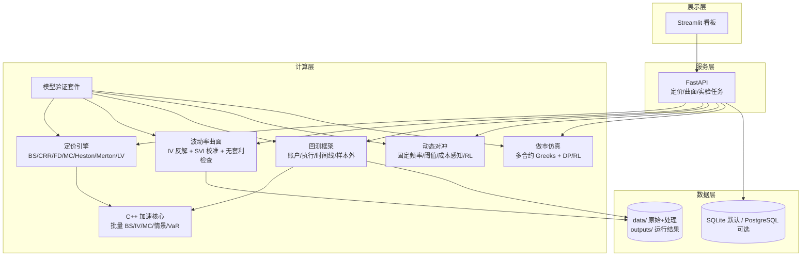
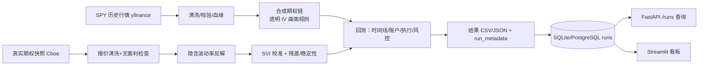
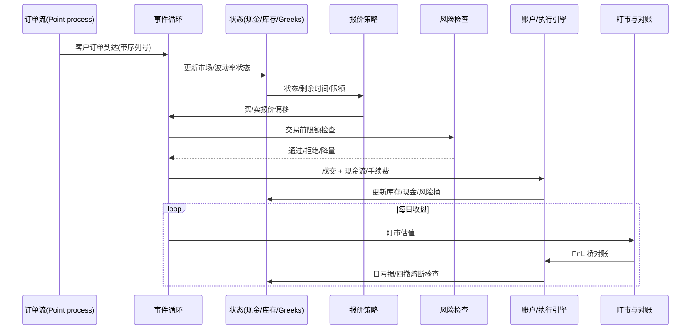

# 系统架构与数据流

三张图对应任务十八的架构要求：系统分层、数据流、做市事件流。每张图后附
说明文字与诚实标注（研究仿真平台，非生产系统）。

## 1. 系统架构（分层）

说明：FastAPI 提供定价/曲面/实验任务接口；计算层各模块通过统一数据结构
协作（`src/domain`、`src/market_data/schemas`）；C++ 内核通过 ctypes 被
Python 调用（计算段释放 GIL）。结果默认落 SQLite，设置 `DATABASE_URL`
时切换到 PostgreSQL 仓储（CI 用服务容器验证）。

## 2. 数据流（SPY → 曲面 → 回测 → 落库 → 看板）

说明：真实历史期权链不可得，因此“合成期权链”与“真实期权快照分析”是
两条独立数据路径，报告与 README 严格区分二者，不做“真实历史期权回测”
的表述。

## 3. 做市仿真事件流（事件驱动）

说明：同一时间戳下的事件按序列号确定顺序执行，避免“用成交后信息生成
成交前报价”的前视；RL/DP 与规则策略在同一订单流、同一 seed 下对照评估
（`src/market_making/study.py`）。

## 图例与配色约定

- 分层图：展示/服务/计算/数据自上而下；
- 数据流图：从左到右 = 时间先后；虚线路径 = 可选（PostgreSQL）；
- 事件流：顺序图强调“先状态、再报价、后成交、最后盯市对账”的固定顺序。

代码仓库中的图均以 Mermaid 源文本保存（GitHub 原生渲染），不依赖外部图片
服务。
