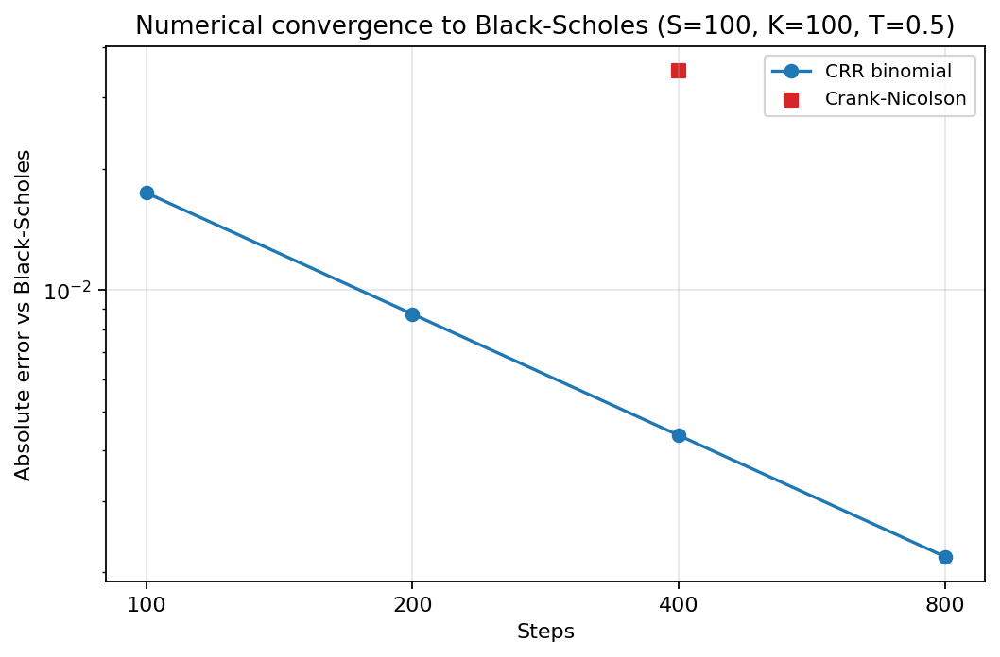
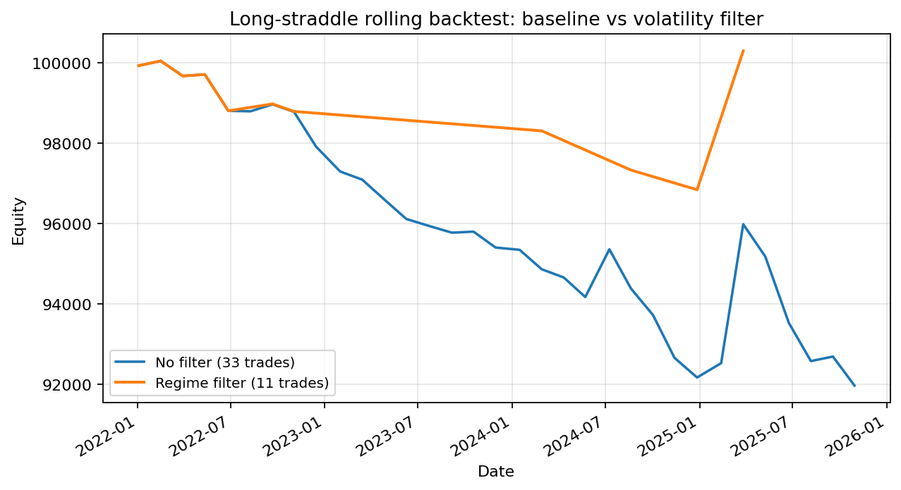
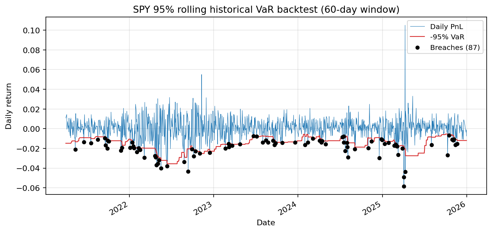

# 研究报告

本项目研究报告（Markdown，GitHub 可直接阅读）。所有数字均来自仓库内
`outputs/`、`tests/` 或 `scripts/` 可复现的运行结果；引用处标注了来源文件。

## 章节

1. [引言](sections/01_introduction.md)
2. [定价引擎](sections/02_pricing_engine.md)
3. [波动率曲面](sections/03_volatility_surface.md)
4. [回测框架](sections/04_backtesting.md)
5. [动态对冲](sections/05_dynamic_hedging.md)
6. [做市仿真](sections/06_market_making.md)
7. [高性能计算](sections/07_high_performance.md)
8. [验证体系](sections/08_validation.md)
9. [结果与讨论](sections/09_results.md)
10. [局限性](sections/10_limitations.md)
11. [结论与未来工作](sections/11_conclusion.md)

## 配套材料

- [系统架构图与数据流](../docs/architecture.md)
- [模型验证报告生成器](../scripts/run_validation_report.py)
- 复现指南与模块文档：见仓库根 `README.md` 的“文档”一节。

## 图表（`figures/`，由 `scripts/generate_report_figures.py` 生成）

完整列表：

- `pricing_convergence.png`：CRR/Crank-Nicolson 相对 Black-Scholes 的收敛误差；
- `degeneracy_validation.png`：Merton/Heston 极限退化误差；
- `svi_surface.png`：真实 SPY 期权链 SVI 拟合与残差（分到期）；
- `spy_rolling_long_straddle_equity_curve.png`：legacy 滚动回测权益与回撤；
- `volatility_filter_comparison.png`：波动率过滤前后权益曲线对比；
- `hedging_cost_sensitivity.png`：对冲阈值下 PnL 与交易成本；
- `var_backtest_breaches.png`：SPY 95% 滚动历史 VaR 回测与违约点；
- `cpp_speedup.png`：C++ 批量内核 vs Python 标量循环（实测）。

## 诚实性声明

本报告是研究项目报告，展示方法论严谨性与工程能力，不是学术论文，也不是
商业产品文档。历史回测使用真实 SPY 标的价格与**合成期权报价**；真实期权链
仅用于快照分析，不构成真实历史期权回测。
